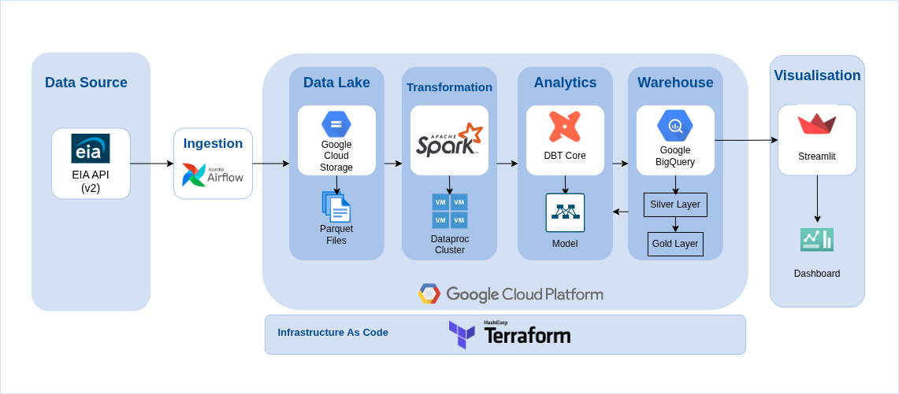
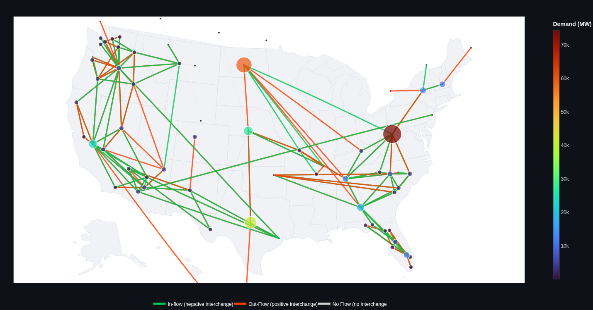
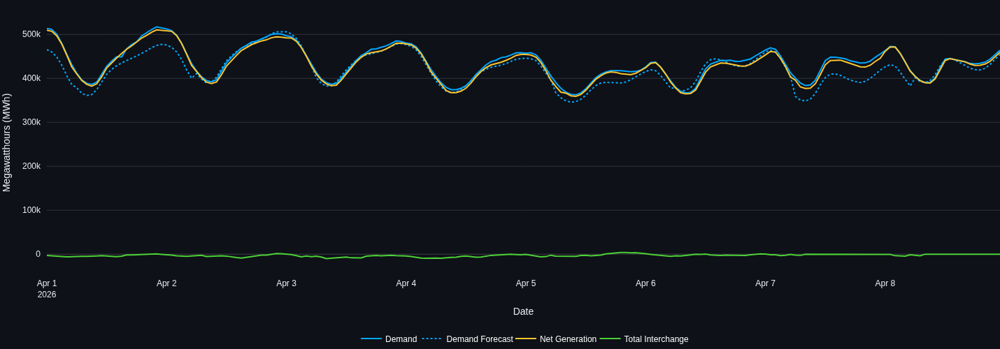
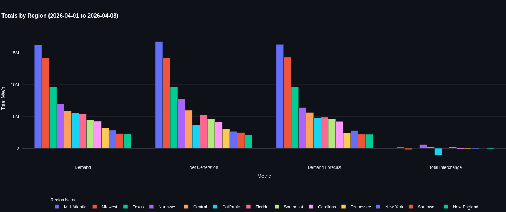
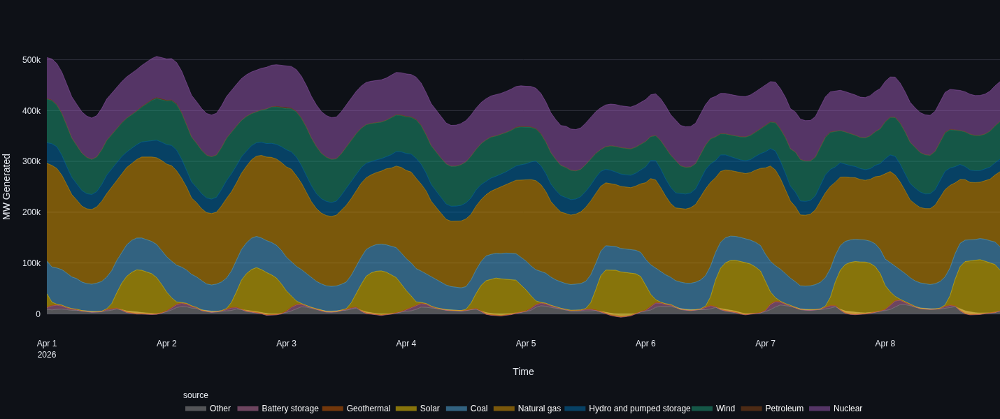
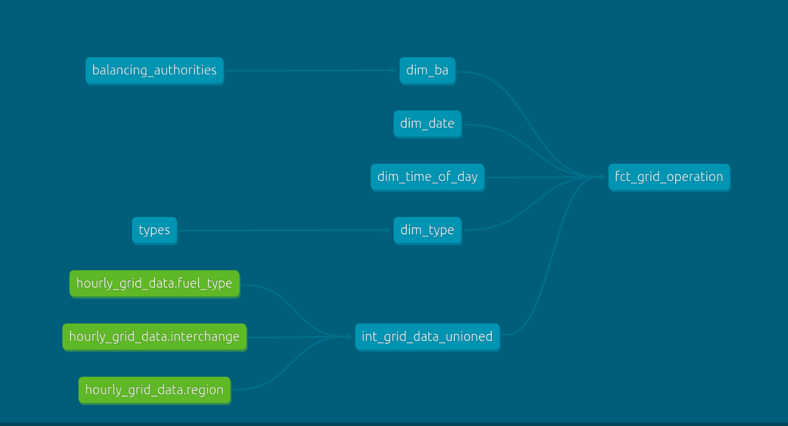

# US Electric Grid Monitoring


> **Live Demo:** [https://us-electric-grid-monitoring.streamlit.app/](https://us-electric-grid-monitoring.streamlit.app/)

---
## Table of Content
* [Introduction](#introduction)
* [Data Pipeline Architecture](#data-pipeline-architecture)
* [Dashboard Features](#dashboard-features)
* [How to run](#how-to-run)
* [References](#references)


---

## Introduction

The US organism [EIA (Energy Information Administration)](https://www.eia.gov/) provides a centralized API as a source for **hourly** operating data about **electric power grid in the 48 states**. 
This data is collected from electricity balancing authorities (BAs) that operate the grid.

A **Balancing Authority (BA)** is an organization responsible for ensuring that the amount of electricity being produced by power plants matches exactly the amount of electricity being consumed by users (homes and businesses) at every single second of the day.

If they don't keep that balance, the grid becomes unstable, which can cause frequency issues or blackouts.

This is a list of of some types of data served by the Api ([link to source](https://www.eia.gov/opendata/browser/electricity/rto)), that I used in this project:

- **Hourly Demand**:
Demand is the total amount of electricity being consumed in a specific area. To find this metric, a BA takes all the power it produces and subtracts any power it sends away to other BAs. What is left over is what was actually used by the people and businesses in that area.

- **Hourly Demand Forecast**:
Each day, each BA predicts exactly how much power people will need for every hour of the following day (D+1). By guessing the demand ahead, they can make sure they have enough power plants running and they are producing exactly the power amount that will be consumed.

- **Hourly Net Generation by energy source**:
Is the measure of the electricity produced by Generators. It represent the power coming out of large facilities like wind farms, nuclear plants, and gas stations that the grid operators can monitor directly. 

- **Hourly Interchange with directly interconnected BAs**:
Is the flow from one BA to another directly interconnected BA. Negative interchange values indicate net inflows, and positive interchange values indicate net outflows.

The goal of this project is to build **an end-to-end data pipeline** that automatically fetches, cleans, and visualizes hourly US electric grid data, by transforming raw API information into an interactive dashboard for monitoring energy demand, interchange and generation trends.


## Data Pipeline Architecture


## Dashboard Features

### Hourly Electric Grid Monitor
An interactive map showing hourly power interchange between grid operators and regional demand intensity. It uses dynamic bubbles and colored lines to visualize how electricity moves between BAs in response to local needs.

**NB**: If data is note available the BAs (nodes) and connexions (edges) are shown in black color.



### Combined Grid Operations for: Demand, Net Generation, and Interchange

A time-series line chart that tracks the balance between power production and consumption over a selected date range. It allows you to compare actual generation, demand against forecasts and monitor how much total energy is being traded between regions.



### Regional Energy Composition

A bar chart that breaks down key energy metrics like total demand and generation across different US geographic regions. It provides a comparative look at which parts of the country are the largest consumers and producers of electricity.



### Electricity Generation By Energy Source

An area chart displaying the daily generation by source type used to power the grid, from renewables like wind and solar to traditional sources like natural gas and nuclear.



## How to run

Follow these steps to run the project :

### 1. Prerequisites

- **An EIA API key** : by registering using the registration form [this link](https://www.eia.gov/opendata/). The process is easy and response is quick. You need to store the key in a secure location and use it in this project.

- **Google Cloud Platform**: An active account.

- **Terraform**: Installed locally.

- **Docker**: For running Airflow and dbt.

- **GCP Service Account**: A key file (`credentials.json`) with permissions for GCS, BigQuery, and Dataproc/Spark.


### 2. Setup Terraform
First, complete the file `\terraform\variables.tf` to profide informations needed to create the bucket and dataset then run the following commands :

```bash
cd terraform
terraform init
terraform plan 
terraform apply
```

### 3. Orchestration with Airflow
#### Data Availability
The EIA publishes different grid metrics on varying schedules. All the DAGs are designed to respect this schedule :

- **Hourly Demand and Demand Forecast**: Available hourly (1 hour after the operating hour ends).

- **Net Generation & Fuel Mix**: Available daily by 15:00 UTC for the previous day.

- **Interchange**: Available daily by 15:00 UTC for two days prior.

Start the Airflow environment to begin data ingestion and Spark processing.
1. Place your GCP service account and EIA api key paths in `.env`, a template is available [here](#environment-variables)
2. Launch the containers:
```bash
cd ../airflow
docker-compose up -d
```
3. Access the Airflow UI at `localhost:8080`.
4. Trigger DAGs: 
    * Activate your dags and setup the connexion to CGP (follow [instructions](https://airflow.apache.org/docs/apache-airflow/3.1.7/howto/connection.html#visibility-in-ui-and-cli) )
    * The `fetch_...` DAGs first ingest raw JSON from EIA into GCS as parquet files. They will run automatically at the scheduled time.
    The parquet files are named following the pattern **(api_route/YYYY/MM/DD/data.parquet)** to make them easily requested by spark jobs that take the date **(YYYY/MM/DD)** as an argument of wich data to process.
    * Run the `spark_job_...` DAGs to transform the GCS parquet files and load it into BigQuery staging tables.
    * Run **Backfills** for data from 2019-01-01 (this can take an hour because of relly big amount of data and api limitations)

**NB:** The specific throttles for the API are less than ~9,000 requests per hour and your burst rate beneath 5 per second. This is already being handled in the airflow DAGs.

### 4. Data Modeling with dbt
Once the cleaned data is in BigQuery, use **dbt** to build the dimensional model (Star Schema).
```bash
cd ../dbt_core
docker compose run --rm dbt seed
docker compose run --rm dbt run
docker compose run --rm dbt test
```
This command will run the seeds (BA and Type mapping), then run the models, and finally perform data quality tests.

The documentation is generated using this command :

```bash
docker compose run --rm -p 8081:8080 dbt docs serve
```
Access the generated documentation at `localhost:8081`.

### 5. Launch the Streamlit Dashboard
Finally, run the interactive visualization locally.
1. Create a `.streamlit/secrets.toml` file with your GCP credentials.
2. Install dependencies and run:
```bash
cd ../dashboard_streamlit
pip install -r requirements.txt
streamlit run streamlit_app.py
```
### Environment Variables
To run this project, you need to create a .env file in the root directory. Use the following template:

```Bash
# Airflow Configuration
AIRFLOW_UID=1000

# GCP Credentials & Project Info
GCP_PROJECT_ID=
GCP_DATASET=
GCP_SERVICE_ACCOUNT_PATH=/path/to/your/gcp-service-account.json
EIA_API_KEY_PATH=/path/to/your/eia-api-key.json

# Cloud Storage Buckets
GCP_BUCKET_NAME=
GCP_BUCKET_SOURCE_NAME=

# Spark Configuration
CLUSTER_NAME=eia-spark-cluster
SPARK_REGION_JOB_PATH=/path/to/your/spark_jobs/transform_and_load_region.py
SPARK_FUEL_TYPE_JOB_PATH=/path/to/your/spark_jobs/transform_and_load_fuel_type.py
SPARK_INTERCHANGE_JOB_PATH=/path/to/your/spark_jobs/transform_and_load_interchange.py
```
## Kimball Star Schema



## References
<details>
<summary><b>See all</b></summary>

#### EIA (Data Source) 
- https://www.eia.gov/electricity/gridmonitor/dashboard/electric_overview/US48/US48

#### GCS
- https://docs.cloud.google.com/storage/docs/objects#hns-namespace
- https://docs.cloud.google.com/storage/docs/hns-overview

#### Airflow
- https://airflow.apache.org/docs/apache-airflow/3.1.7/howto/connection.html#visibility-in-ui-and-cli
- https://airflow.apache.org/docs/apache-airflow/stable/administration-and-deployment/pools.html
- https://airflow.apache.org/docs/apache-airflow-providers-google/stable/_api/airflow/providers/google/cloud/hooks/gcs/index.html
- https://airflow.apache.org/docs/apache-airflow/stable/templates-ref.html
- https://airflow.apache.org/docs/apache-airflow-providers-google/stable/_api/airflow/providers/google/cloud/hooks/gcs/index.html#airflow.providers.google.cloud.hooks.gcs
- https://airflow.apache.org/docs/apache-airflow/stable/core-concepts/taskflow.html
https://airflow.apache.org/docs/apache-airflow/1.10.3/_api/airflow/sensors/external_task_sensor/index.html
- https://airflow.apache.org/docs/apache-airflow-providers-google/stable/_api/airflow/providers/google/cloud/operators/dataproc/index.html
- https://airflow.apache.org/docs/apache-airflow-providers-google/stable/operators/cloud/dataproc.html
- https://airflow.apache.org/docs/apache-airflow-providers-standard/stable/_api/airflow/providers/standard/operators/trigger_dagrun/index.html

#### Advanced Python
- https://arrow.apache.org/docs/python/memory.html
- https://pandas.pydata.org/pandas-docs/stable/user_guide/merging.html

#### Apache Spark 
- https://www.instaclustr.com/education/apache-spark/8-amazing-apache-spark-use-cases-with-code-examples/
- https://spark.apache.org/docs/latest/sql-ref-syntax-qry-select-join.html
- https://kaninipro.com/2025/07/21/unique-key-in-spark-dataframe/

#### Dataproc
- https://docs.cloud.google.com/dataproc/docs/concepts/overview
- https://registry.terraform.io/providers/hashicorp/google/latest/docs/resources/dataproc_cluster#
- https://docs.cloud.google.com/sdk/gcloud/reference/dataproc/clusters/delete
- https://codelabs.developers.google.com/codelabs/spark-jupyter-dataproc
- https://docs.cloud.google.com/dataproc/docs/concepts/connectors/cloud-storage
- https://docs.cloud.google.com/dataproc/docs/tutorials/jupyter-notebook

#### BigQuery 
- https://www.geeksforgeeks.org/devops/google-cloud-platform-introduction-to-bigquery/
- https://codelabs.developers.google.com/codelabs/pyspark-bigquery#0
- https://github.com/GoogleCloudDataproc/spark-bigquery-connector
- https://discuss.google.dev/t/structured-streaming-data-upsert-into-bigquery/132839

#### Data Transformation
- https://www.ovaledge.com/blog/data-cleaning-techniques
- https://feat.engineering/08-Handling_Missing_Data.html

#### DBT
- https://blog.dataengineerthings.org/dbt-core-and-bigquery-a-complete-guide-to-automating-data-transformations-with-github-ci-cd-0b46121c66db
- https://docs.getdbt.com/docs/local/install-dbt?version=1.12
- https://github.com/bruno-szdl/dbt-cheatsheet/blob/main/dbt_cheat_sheet.pdf

#### Data Modeling
- https://www.kimballgroup.com/data-warehouse-business-intelligence-resources/kimball-techniques/dimensional-modeling-techniques
- https://donnypeeters.com/blog/dimensional-modeling/
- https://stackoverflow.com/questions/62660514/enddate-on-dimension-table-should-we-go-with-null-or-99991231-date-value
- https://dev.to/shiviyer/how-to-use-kimball-helper-tablepostgresql-in-modern-banking-for-performance-analysis-and-monetisation-1jdo
- https://gist.github.com/ficus/ca48b3c1ffbe9f77eda0ad2d501cb8ce

#### Dashboard
- https://docs.streamlit.io/get-started/installation
- https://docs.streamlit.io/develop/api-reference
- https://docs.streamlit.io/get-started/tutorials/create-an-app
- https://docs.streamlit.io/develop/tutorials/databases/bigquery
- https://medium.com/@verinamk/streamlit-for-beginners-build-your-first-dashboard-58b764a62a2d

</details>
